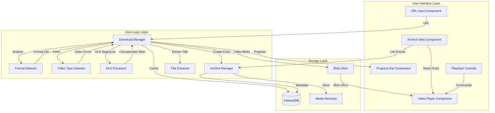
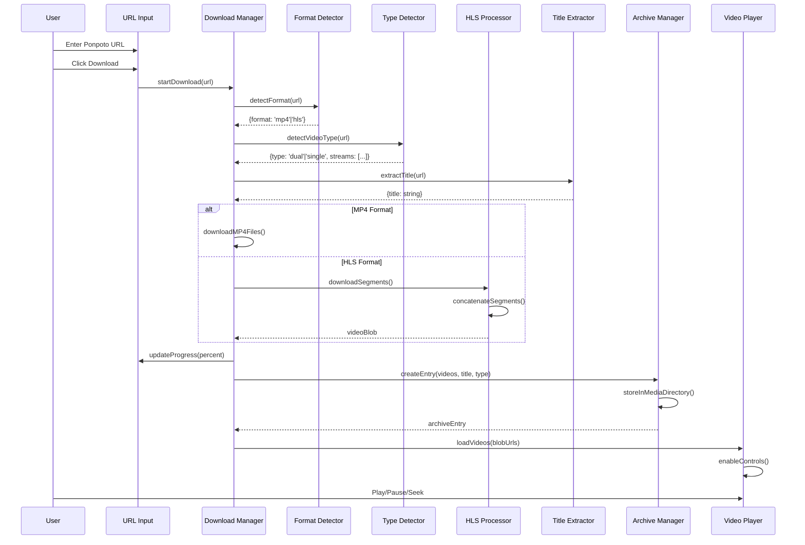
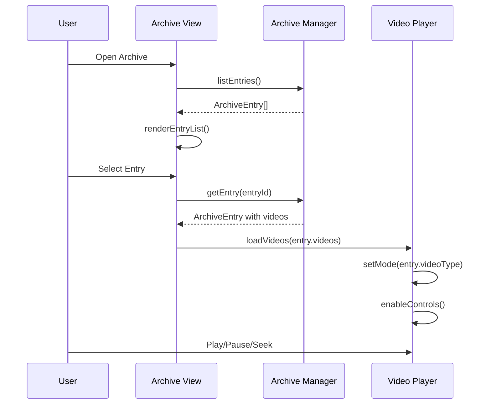

# Design Document: Ponpoto Video Downloader

## Overview

The Ponpoto Video Downloader is a client-side web application that enables users to download and play videos from Ponpoto URLs. The application automatically detects video format (MP4 vs HLS/TS segments) and video type (dual vs single), downloads all media for offline viewing, and provides a synchronized video player based on the existing dual-video-player.html template. The app includes a Video Archive/Library feature that displays all previously downloaded videos, supports video title management, groups dual videos as single entries, and organizes content in a structured media directory.

### Key Design Decisions

1. **Client-Side Only**: All processing happens in the browser using JavaScript APIs (Fetch, Blob, IndexedDB) - no server backend required
2. **Offline-First**: Videos are fully downloaded and stored locally before playback is enabled
3. **Format Auto-Detection**: The app inspects network responses to determine MP4 vs HLS format
4. **Template-Based UI**: Extends the existing dual-video-player.html with URL input and download functionality
5. **Structured Storage**: Downloaded videos are organized in a media directory with separate subdirectories per download
6. **Archive-Centric**: All downloads are tracked in a Video Archive for easy access and management

## Architecture



### Component Interaction Flow



### Archive Selection Flow



## Components and Interfaces

### 1. URL Input Component

Replaces the file upload section from dual-video-player.html with a URL input field and download button.

```typescript
interface URLInputComponent {
  // DOM Elements
  urlInput: HTMLInputElement;
  downloadButton: HTMLButtonElement;
  errorDisplay: HTMLElement;
  
  // Methods
  getURL(): string;
  setError(message: string): void;
  clearError(): void;
  setLoading(loading: boolean): void;
  
  // Events
  onDownloadClick: (url: string) => void;
}
```

### 2. Format Detector

Analyzes the Ponpoto URL response to determine video format.

```typescript
interface FormatDetector {
  /**
   * Detects whether the URL contains MP4 or HLS format videos
   * @param url - The Ponpoto URL to analyze
   * @returns Format detection result
   */
  detectFormat(url: string): Promise<FormatDetectionResult>;
}

interface FormatDetectionResult {
  format: 'mp4' | 'hls';
  urls: string[];  // Direct URLs to video files or m3u8 playlist
  error?: string;
}
```

### 3. Video Type Detector

Determines if the content is dual video or single video.

```typescript
interface VideoTypeDetector {
  /**
   * Detects whether content has one or two video streams
   * @param formatResult - Result from format detection
   * @returns Video type detection result
   */
  detectType(formatResult: FormatDetectionResult): Promise<VideoTypeResult>;
}

interface VideoTypeResult {
  type: 'dual' | 'single';
  streams: VideoStream[];
  error?: string;
}

interface VideoStream {
  id: string;
  url: string;
  label: string;  // 'primary' | 'secondary' for dual, 'main' for single
}
```

### 4. Download Manager

Orchestrates the download process and manages progress reporting.

```typescript
interface DownloadManager {
  /**
   * Downloads all video content from the given URL
   * @param url - The Ponpoto URL
   * @param onProgress - Progress callback
   * @returns Downloaded video blobs
   */
  download(url: string, onProgress: ProgressCallback): Promise<DownloadResult>;
  
  /**
   * Cancels an in-progress download
   */
  cancel(): void;
}

type ProgressCallback = (progress: DownloadProgress) => void;

interface DownloadProgress {
  phase: 'detecting' | 'downloading' | 'processing' | 'complete';
  percent: number;
  message: string;
  segmentInfo?: {
    current: number;
    total: number;
  };
}

interface DownloadResult {
  success: boolean;
  videoType: 'dual' | 'single';
  videos: VideoBlob[];
  error?: string;
}

interface VideoBlob {
  label: string;
  blob: Blob;
  blobUrl: string;
}
```

### 5. HLS Processor

Handles downloading and concatenating HLS .ts segments.

```typescript
interface HLSProcessor {
  /**
   * Downloads all segments from an HLS playlist and concatenates them
   * @param playlistUrl - URL to the m3u8 playlist
   * @param onProgress - Progress callback for segment downloads
   * @returns Concatenated video blob
   */
  processPlaylist(
    playlistUrl: string, 
    onProgress: (current: number, total: number) => void
  ): Promise<Blob>;
  
  /**
   * Parses m3u8 playlist to extract segment URLs
   */
  parsePlaylist(content: string, baseUrl: string): string[];
  
  /**
   * Concatenates multiple TS segments into a single blob
   */
  concatenateSegments(segments: ArrayBuffer[]): Blob;
}
```

### 6. Video Player Component

Extended from dual-video-player.html to support both dual and single video modes.

```typescript
interface VideoPlayerComponent {
  // State
  mode: 'dual' | 'single';
  isPlaying: boolean;
  currentSpeed: number;
  
  // Methods
  loadVideos(videos: VideoBlob[]): void;
  setMode(mode: 'dual' | 'single'): void;
  play(): void;
  pause(): void;
  stop(): void;
  seek(timeSeconds: number): void;
  setSpeed(rate: number): void;
  setSize(size: 'small' | 'medium' | 'large'): void;
  enterFullscreen(): void;
  swapVideos(): void;
  togglePrimary(): void;
  
  // Sync (dual mode only)
  syncVideos(): void;
  
  // Events
  onTimeUpdate: (currentTime: number, duration: number) => void;
}
```

### 7. Progress Bar Component

Displays download progress with real-time updates.

```typescript
interface ProgressBarComponent {
  // Methods
  show(): void;
  hide(): void;
  setProgress(percent: number): void;
  setMessage(message: string): void;
  setSegmentInfo(current: number, total: number): void;
}
```

### 8. Storage Manager

Handles caching downloaded videos in IndexedDB for offline access.

```typescript
interface StorageManager {
  /**
   * Stores video blob in IndexedDB
   */
  saveVideo(key: string, blob: Blob): Promise<void>;
  
  /**
   * Retrieves video blob from IndexedDB
   */
  getVideo(key: string): Promise<Blob | null>;
  
  /**
   * Checks if video exists in cache
   */
  hasVideo(key: string): Promise<boolean>;
  
  /**
   * Clears cached videos
   */
  clearCache(): Promise<void>;
}
```

### 9. Archive Manager

Manages the Video Archive, including creating entries, storing metadata, and organizing the media directory structure.

```typescript
interface ArchiveManager {
  /**
   * Creates a new archive entry for downloaded videos
   * @param videos - Downloaded video blobs
   * @param title - Title for the entry (extracted or user-provided)
   * @param videoType - Whether this is dual or single video
   * @param sourceUrl - Original Ponpoto URL
   * @returns Created archive entry
   */
  createEntry(
    videos: VideoBlob[],
    title: string,
    videoType: 'dual' | 'single',
    sourceUrl: string
  ): Promise<ArchiveEntry>;
  
  /**
   * Lists all archive entries
   * @returns Array of all archive entries sorted by download date (newest first)
   */
  listEntries(): Promise<ArchiveEntry[]>;
  
  /**
   * Retrieves a specific archive entry with its video blobs
   * @param entryId - Unique identifier for the entry
   * @returns Archive entry with loaded video blob URLs
   */
  getEntry(entryId: string): Promise<ArchiveEntryWithVideos | null>;
  
  /**
   * Updates the title of an archive entry
   * @param entryId - Unique identifier for the entry
   * @param newTitle - New title for the entry
   */
  updateTitle(entryId: string, newTitle: string): Promise<void>;
  
  /**
   * Deletes an archive entry and its associated files
   * @param entryId - Unique identifier for the entry
   */
  deleteEntry(entryId: string): Promise<void>;
}

interface ArchiveEntry {
  id: string;
  title: string;
  videoType: 'dual' | 'single';
  sourceUrl: string;
  downloadDate: Date;
  directoryPath: string;  // Path to Download_Directory
  videoCount: number;     // 1 for single, 2 for dual
}

interface ArchiveEntryWithVideos extends ArchiveEntry {
  videos: VideoBlob[];
}
```

### 10. Archive View Component

Displays the Video Archive UI with list of downloaded videos.

```typescript
interface ArchiveViewComponent {
  // DOM Elements
  container: HTMLElement;
  entryList: HTMLElement;
  emptyState: HTMLElement;
  
  // Methods
  render(entries: ArchiveEntry[]): void;
  showEmptyState(): void;
  hideEmptyState(): void;
  highlightEntry(entryId: string): void;
  
  // Edit mode
  enableTitleEdit(entryId: string): void;
  saveTitleEdit(entryId: string, newTitle: string): void;
  cancelTitleEdit(entryId: string): void;
  
  // Events
  onEntrySelect: (entryId: string) => void;
  onEntryDelete: (entryId: string) => void;
  onTitleEdit: (entryId: string, newTitle: string) => void;
}
```

### 11. Title Extractor

Extracts video titles from source web pages.

```typescript
interface TitleExtractor {
  /**
   * Extracts title from the Ponpoto page
   * @param url - The Ponpoto URL
   * @param pageContent - HTML content of the page (optional, will fetch if not provided)
   * @returns Extracted title or null if extraction fails
   */
  extractTitle(url: string, pageContent?: string): Promise<string | null>;
  
  /**
   * Generates a default title when extraction fails
   * @param url - The source URL
   * @param downloadDate - Date of download
   * @returns Generated default title
   */
  generateDefaultTitle(url: string, downloadDate: Date): string;
}
```

## Data Models

### Application State

```typescript
interface AppState {
  // URL Input State
  url: string;
  urlError: string | null;
  
  // Download State
  downloadStatus: 'idle' | 'detecting' | 'downloading' | 'processing' | 'complete' | 'error';
  downloadProgress: number;  // 0-100
  downloadMessage: string;
  downloadError: string | null;
  
  // Video State
  videoFormat: 'mp4' | 'hls' | null;
  videoType: 'dual' | 'single' | null;
  videos: LoadedVideo[];
  
  // Playback State
  isPlaying: boolean;
  currentTime: number;
  duration: number;
  playbackSpeed: number;
  playerSize: 'small' | 'medium' | 'large';
  primaryVideoIndex: number;  // 0 or 1 for dual mode
}

interface LoadedVideo {
  label: string;
  blobUrl: string;
  element: HTMLVideoElement;
}
```

### Media Directory Structure

```typescript
/**
 * Media directory organization:
 * 
 * /media/                          <- Media_Directory (root)
 *   /{entry-id-1}/                 <- Download_Directory for entry 1
 *     metadata.json                <- Entry metadata
 *     video-primary.mp4            <- Primary video file
 *     video-secondary.mp4          <- Secondary video (dual only)
 *   /{entry-id-2}/                 <- Download_Directory for entry 2
 *     metadata.json
 *     video-main.mp4               <- Single video file
 */

interface MediaDirectoryStructure {
  rootPath: string;  // 'media' in IndexedDB
  entries: Map<string, DownloadDirectory>;
}

interface DownloadDirectory {
  entryId: string;
  path: string;  // e.g., 'media/{entry-id}'
  files: DownloadedFile[];
}

interface DownloadedFile {
  name: string;
  type: 'video' | 'metadata';
  mimeType: string;
  size: number;
}

interface EntryMetadata {
  id: string;
  title: string;
  videoType: 'dual' | 'single';
  sourceUrl: string;
  downloadDate: string;  // ISO 8601 format
  videos: VideoFileInfo[];
}

interface VideoFileInfo {
  label: string;  // 'primary', 'secondary', or 'main'
  filename: string;
  mimeType: string;
  size: number;
}
```

### HLS Playlist Model

```typescript
interface HLSPlaylist {
  version: number;
  targetDuration: number;
  segments: HLSSegment[];
}

interface HLSSegment {
  url: string;
  duration: number;
  sequence: number;
}
```

### Error Types

```typescript
type AppError = 
  | { type: 'EMPTY_URL'; message: string }
  | { type: 'INVALID_URL'; message: string }
  | { type: 'FORMAT_DETECTION_FAILED'; message: string }
  | { type: 'NETWORK_ERROR'; message: string; details?: string }
  | { type: 'URL_INACCESSIBLE'; message: string }
  | { type: 'DOWNLOAD_FAILED'; message: string; segmentIndex?: number }
  | { type: 'PROCESSING_FAILED'; message: string }
  | { type: 'ARCHIVE_LOAD_FAILED'; message: string }
  | { type: 'ENTRY_NOT_FOUND'; message: string; entryId: string }
  | { type: 'TITLE_UPDATE_FAILED'; message: string; entryId: string }
  | { type: 'ENTRY_DELETE_FAILED'; message: string; entryId: string }
  | { type: 'STORAGE_QUOTA_EXCEEDED'; message: string };
```


## Correctness Properties

*A property is a characteristic or behavior that should hold true across all valid executions of a system—essentially, a formal statement about what the system should do. Properties serve as the bridge between human-readable specifications and machine-verifiable correctness guarantees.*

### Property 1: URL Validation Rejects Invalid Inputs

*For any* input string that is empty, contains only whitespace, or does not conform to valid URL format, the URL validation function should reject it and return an appropriate error type (EMPTY_URL or INVALID_URL).

**Validates: Requirements 1.3, 1.4**

### Property 2: Format Detection Correctly Identifies Video Format

*For any* network response content, if the content contains references to .mp4 files, the format detector should return 'mp4'; if the content contains references to .ts segment files or .m3u8 playlists, the format detector should return 'hls'.

**Validates: Requirements 2.2, 2.3**

### Property 3: Video Type Detection Based on Stream Count

*For any* format detection result containing video stream URLs, if exactly one stream is present, the type detector should return 'single'; if exactly two streams are present, the type detector should return 'dual'.

**Validates: Requirements 3.2, 3.3**

### Property 4: Player Layout Matches Video Type

*For any* video type ('dual' or 'single'), when videos are loaded into the player, the number of visible video containers should equal the number of video streams (2 for dual, 1 for single).

**Validates: Requirements 3.4, 3.5, 6.1, 7.1**

### Property 5: Download Progress Reporting

*For any* download operation in progress, the progress callback should be invoked with increasing percentage values (0-100) and the progress should never decrease during a single download session.

**Validates: Requirements 4.2, 5.2, 10.2, 11.3, 11.4**

### Property 6: Successful Download Loads Videos

*For any* successful download operation (MP4 or HLS), the result should contain video blobs with valid blob URLs, and the number of video blobs should match the detected video type (1 for single, 2 for dual).

**Validates: Requirements 4.3, 5.4**

### Property 7: HLS Segment Concatenation Produces Valid Blob

*For any* array of valid TS segment ArrayBuffers, concatenating them should produce a single Blob with MIME type 'video/mp2t' and size equal to the sum of all segment sizes.

**Validates: Requirements 5.3**

### Property 8: Dual Video Playback Control Synchronization

*For any* dual video player state, when play() is called both videos should be playing, when pause() is called both videos should be paused, and when stop() is called both videos should be paused with currentTime equal to 0.

**Validates: Requirements 6.3, 6.4, 6.5**

### Property 9: Dual Video Time Synchronization

*For any* dual video player during playback or after seek, the absolute difference between the currentTime of both videos should be less than 0.15 seconds (synchronization tolerance).

**Validates: Requirements 6.2, 6.6**

### Property 10: Speed Control Applies to All Videos

*For any* playback speed value (0.5, 1, 1.25, 1.5, 2), when setSpeed() is called, all loaded video elements should have their playbackRate property set to that value.

**Validates: Requirements 8.2**

### Property 11: Size Control Updates Container

*For any* size setting ('small', 'medium', 'large'), when setSize() is called, the container's max-width style should be set to the corresponding value (1000px, 1400px, 100%).

**Validates: Requirements 9.2**

### Property 12: Single Mode Hides Dual-Specific Controls

*For any* player in single video mode, the swap button and toggle primary button should not be visible (display: none or visibility: hidden).

**Validates: Requirements 7.4**

### Property 13: Playback Disabled Until Download Complete

*For any* app state where downloadStatus is not 'complete', the playback controls (play button) should be disabled and clicking them should have no effect.

**Validates: Requirements 11.1, 11.5, 11.8**

### Property 14: Storage Persistence Round Trip

*For any* video blob stored via StorageManager.saveVideo(), calling StorageManager.getVideo() with the same key should return a blob with identical size and type.

**Validates: Requirements 11.2, 11.6**

### Property 15: Archive Entry Creation for Downloads

*For any* successful download operation, an ArchiveEntry should be created with the correct videoType ('dual' if 2 videos, 'single' if 1 video), a non-empty title, and a unique directory path.

**Validates: Requirements 12.1, 12.2, 13.1**

### Property 16: Dual Video Grouping in Archive

*For any* ArchiveEntry with videoType 'dual', the entry should have exactly one title shared by both videos, and selecting the entry should load exactly 2 videos into the player.

**Validates: Requirements 13.2, 13.3, 13.4**

### Property 17: Archive Entry List Ordering

*For any* call to ArchiveManager.listEntries(), the returned entries should be sorted by downloadDate in descending order (newest first).

**Validates: Requirements 12.1**

### Property 18: Title Extraction or Default Generation

*For any* download operation, the resulting ArchiveEntry should have a non-empty title that is either extracted from the source page or generated as a default.

**Validates: Requirements 12.3, 12.4**

### Property 19: Archive Entry Deletion Removes Directory

*For any* ArchiveEntry that is deleted via ArchiveManager.deleteEntry(), the corresponding Download_Directory and all its contents should no longer exist in storage.

**Validates: Requirements 15.5**

### Property 20: Media Directory Structure Consistency

*For any* ArchiveEntry, there should exist a corresponding Download_Directory containing a metadata.json file and video files matching the entry's videoType (1 file for single, 2 files for dual).

**Validates: Requirements 15.2, 15.3, 15.4**

### Property 21: Archive Selection Loads Correct Player Mode

*For any* ArchiveEntry selected from the archive, the Video_Player should be set to the mode matching the entry's videoType ('dual' or 'single').

**Validates: Requirements 14.2, 14.3**

## Error Handling

### Error Categories and User Messages

| Error Type | Trigger Condition | User Message |
|------------|-------------------|--------------|
| EMPTY_URL | Download clicked with empty input | "Please enter a Ponpoto URL" |
| INVALID_URL | URL doesn't match valid URL pattern | "Invalid URL format. Please enter a valid Ponpoto URL" |
| FORMAT_DETECTION_FAILED | Cannot identify MP4 or HLS in response | "Could not detect video format. The URL may not contain valid video content" |
| NETWORK_ERROR | Fetch fails due to network issues | "Network error: {details}. Please check your connection" |
| URL_INACCESSIBLE | 404, 403, or other HTTP errors | "Cannot access URL: {status}. Please verify the URL is correct" |
| DOWNLOAD_FAILED | MP4 download fails | "Download failed: {reason}" |
| SEGMENT_FAILED | Individual TS segment fails | "Failed to download segment {index} of {total}" |
| PROCESSING_FAILED | HLS concatenation fails | "Failed to process video segments" |
| ARCHIVE_LOAD_FAILED | Cannot load archive entries | "Failed to load video archive" |
| ENTRY_NOT_FOUND | Archive entry doesn't exist | "Video not found in archive" |
| TITLE_UPDATE_FAILED | Cannot update entry title | "Failed to update video title" |
| ENTRY_DELETE_FAILED | Cannot delete archive entry | "Failed to delete video from archive" |
| STORAGE_QUOTA_EXCEEDED | IndexedDB storage full | "Storage full. Please delete some videos to free space" |

### Error Recovery Strategies

1. **Network Errors**: Display retry button, allow user to attempt download again
2. **Partial HLS Download**: Track downloaded segments, allow resume from last successful segment
3. **Storage Errors**: Fall back to in-memory blob URLs (no offline support)
4. **Playback Errors**: Display error overlay on video, suggest re-downloading

### Error Display Component

```typescript
interface ErrorDisplay {
  show(error: AppError): void;
  hide(): void;
  showRetry(onRetry: () => void): void;
}
```

## Testing Strategy

### Unit Tests

Unit tests focus on specific examples and edge cases:

1. **URL Validation**
   - Empty string returns EMPTY_URL error
   - Whitespace-only string returns EMPTY_URL error
   - String without protocol returns INVALID_URL error
   - Valid URL passes validation

2. **Format Detection Edge Cases**
   - Response with both .mp4 and .ts references (prioritize based on content)
   - Empty response returns error
   - Response with no video references returns error

3. **HLS Playlist Parsing**
   - Parse standard m3u8 with relative URLs
   - Parse m3u8 with absolute URLs
   - Handle missing segments gracefully

4. **Player Controls**
   - Fullscreen button triggers requestFullscreen API
   - Swap button exchanges video wrapper positions
   - Toggle primary switches the 'primary' class between wrappers

5. **Archive Manager**
   - Create entry with single video stores 1 video file
   - Create entry with dual videos stores 2 video files
   - List entries returns empty array when no entries exist
   - Delete entry removes directory and metadata
   - Update title persists new title

6. **Title Extractor**
   - Extract title from valid HTML page
   - Generate default title when extraction fails
   - Handle missing title elements gracefully

### Property-Based Tests

Property-based tests use **fast-check** library for JavaScript/TypeScript. Each test runs minimum 100 iterations.

```typescript
// Example test structure
import fc from 'fast-check';

describe('Ponpoto Video Downloader Properties', () => {
  // Feature: ponpoto-video-downloader, Property 1: URL Validation Rejects Invalid Inputs
  it('should reject all invalid URL inputs', () => {
    fc.assert(
      fc.property(
        fc.oneof(
          fc.constant(''),
          fc.stringOf(fc.constant(' ')),
          fc.string().filter(s => !s.includes('://'))
        ),
        (invalidInput) => {
          const result = validateURL(invalidInput);
          return result.error !== undefined;
        }
      ),
      { numRuns: 100 }
    );
  });

  // Feature: ponpoto-video-downloader, Property 7: HLS Segment Concatenation
  it('should concatenate segments with correct total size', () => {
    fc.assert(
      fc.property(
        fc.array(fc.uint8Array({ minLength: 1, maxLength: 1000 }), { minLength: 1, maxLength: 10 }),
        (segments) => {
          const buffers = segments.map(s => s.buffer);
          const blob = concatenateSegments(buffers);
          const expectedSize = segments.reduce((sum, s) => sum + s.length, 0);
          return blob.size === expectedSize && blob.type === 'video/mp2t';
        }
      ),
      { numRuns: 100 }
    );
  });

  // Feature: ponpoto-video-downloader, Property 14: Storage Round Trip
  it('should retrieve stored blobs with same size and type', async () => {
    await fc.assert(
      fc.asyncProperty(
        fc.tuple(fc.string(), fc.uint8Array({ minLength: 1 })),
        async ([key, data]) => {
          const blob = new Blob([data], { type: 'video/mp4' });
          await storageManager.saveVideo(key, blob);
          const retrieved = await storageManager.getVideo(key);
          return retrieved !== null && 
                 retrieved.size === blob.size && 
                 retrieved.type === blob.type;
        }
      ),
      { numRuns: 100 }
    );
  });

  // Feature: ponpoto-video-downloader, Property 15: Archive Entry Creation
  it('should create archive entry with correct video type', async () => {
    await fc.assert(
      fc.asyncProperty(
        fc.record({
          title: fc.string({ minLength: 1 }),
          videoType: fc.constantFrom('dual', 'single'),
          url: fc.webUrl()
        }),
        async ({ title, videoType, url }) => {
          const videoCount = videoType === 'dual' ? 2 : 1;
          const videos = Array(videoCount).fill(null).map((_, i) => ({
            label: videoType === 'dual' ? (i === 0 ? 'primary' : 'secondary') : 'main',
            blob: new Blob(['test'], { type: 'video/mp4' }),
            blobUrl: 'blob:test'
          }));
          
          const entry = await archiveManager.createEntry(videos, title, videoType, url);
          return entry.videoType === videoType &&
                 entry.title === title &&
                 entry.directoryPath.length > 0;
        }
      ),
      { numRuns: 100 }
    );
  });

  // Feature: ponpoto-video-downloader, Property 16: Dual Video Grouping
  it('should group dual videos under single entry with shared title', async () => {
    await fc.assert(
      fc.asyncProperty(
        fc.string({ minLength: 1 }),
        async (title) => {
          const videos = [
            { label: 'primary', blob: new Blob(['v1']), blobUrl: 'blob:1' },
            { label: 'secondary', blob: new Blob(['v2']), blobUrl: 'blob:2' }
          ];
          
          const entry = await archiveManager.createEntry(videos, title, 'dual', 'http://test.com');
          const loaded = await archiveManager.getEntry(entry.id);
          
          return loaded !== null &&
                 loaded.videos.length === 2 &&
                 loaded.title === title;
        }
      ),
      { numRuns: 100 }
    );
  });

  // Feature: ponpoto-video-downloader, Property 19: Archive Deletion
  it('should remove directory when entry is deleted', async () => {
    await fc.assert(
      fc.asyncProperty(
        fc.string({ minLength: 1 }),
        async (title) => {
          const videos = [{ label: 'main', blob: new Blob(['test']), blobUrl: 'blob:test' }];
          const entry = await archiveManager.createEntry(videos, title, 'single', 'http://test.com');
          
          await archiveManager.deleteEntry(entry.id);
          const retrieved = await archiveManager.getEntry(entry.id);
          
          return retrieved === null;
        }
      ),
      { numRuns: 100 }
    );
  });
});
```

### Integration Tests

1. **Full Download Flow (MP4)**: Mock fetch to return MP4 URLs, verify videos load
2. **Full Download Flow (HLS)**: Mock fetch to return m3u8 playlist, verify segments download and concatenate
3. **Dual Video Sync**: Load two videos, verify sync during playback
4. **Offline Playback**: Store videos, disable network, verify playback works
5. **Archive Flow**: Download video, verify entry appears in archive, select entry, verify playback
6. **Archive Title Edit**: Create entry, edit title, verify title persists after reload
7. **Archive Deletion**: Create entry, delete it, verify entry and files are removed

### Test Configuration

- **Framework**: Jest or Vitest
- **Property Testing**: fast-check
- **Minimum Iterations**: 100 per property test
- **Coverage Target**: 80% line coverage for core logic
